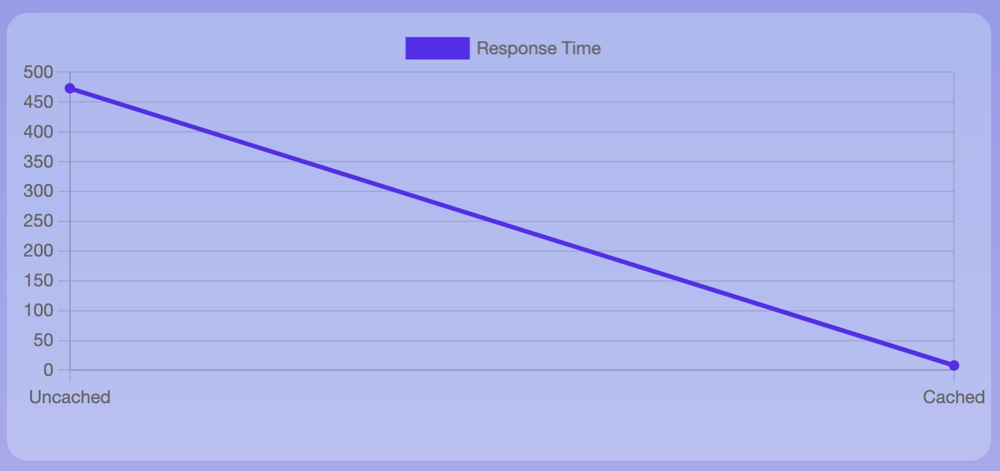
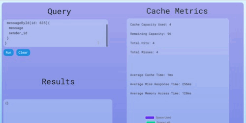

# MagniCache

<p align="center">
  
</p>

## What is MagniCache?

MagniCache is a lightweight and performant GraphQL caching solution. Packaged and shipped as two separate npm packages, MagniCache can be implemented seamlessly into projects as an Express middleware for server-side caching of queries and mutations, or as a localStorage manipulation device for client-side caching.

## Why use MagniCache?

MagniCache is unique in its exceptional efficiency. MagniCache's caching algorithm methodically parses GraphQL queries and divides them into atomic components, allowing for systematic and fully coherent caching of queries and improvements in performance. Unlike other GraphQL caching layers, subsequent GraphQL queries do not have to be exact duplicates of cached queries in order to benefit from cached response speeds. In addition, MagniCache was developed with compactness as the priority, so you can rest assured that implementing MagniCache into your projects will add zero unnecessary bulk.

<p align="center">
  
  <p align="center">Caching of queries leads to nearly instantaneous response times!</p>
</p>

## How to use MagniCache

<a href="https://www.magnicache.us/demo">Click here to demo MagniCache!</a>

Type your GraphQL queries in the Query field on the left and click Run. Check out the query response and metrics below to observe caching in action!

<p align="center">

</p>

<br>

## Installing MagniCache

### Server-Side Caching

```bash
npm i @magnicache/server
```

### Client-Side Caching

```bash
npm i @magnicache/client
```

## Documentation

After deciding on how to implement MagniCache into your project, follow the links below for detailed installation steps.

<ul>
<li><a href="https://github.com/oslabs-beta/MagniCache/blob/dev/magnicache-server/README.md">@magnicache/server</a></li>
<li><a href="https://github.com/oslabs-beta/MagniCache/blob/dev/magnicache-client/README.md">@magnicache/client</a></li>
</ul>

## How to Contribute

As an Open Source Product, we are always welcoming contributions! To be apart of MagniCache, you can follow the steps below:

1. Fork this repository, copying the `dev` branch.

2. Create your feature branch from `dev`.

3. Once you have finished contributing to your feature branch, add and commit all changes.

4. Locally merge your branch with with the `dev` branch.

5. Push your branch to GitHub and open a pull request.

## License

MIT

## Contributors

Ahmed Chami / <a href="https://github.com/Achami64">Github</a> / <a href="https://www.linkedin.com/in/ahmed-chami-dev/">LinkedIn</a>

Aria Soltankhah / <a href="https://github.com/ariasoltank">Github</a> / <a href="https://www.linkedin.com/in/ariasol/">LinkedIn</a>

Truman Miller / <a href="https://github.com/trumanmiller">Github</a> / <a href="https://www.linkedin.com/in/truman-miller/">LinkedIn</a>

Yousuf Elkhoga / <a href="https://github.com/yousuf-e">Github</a> / <a href="https://www.linkedin.com/in/yousufelkhoga/">LinkedIn</a>
